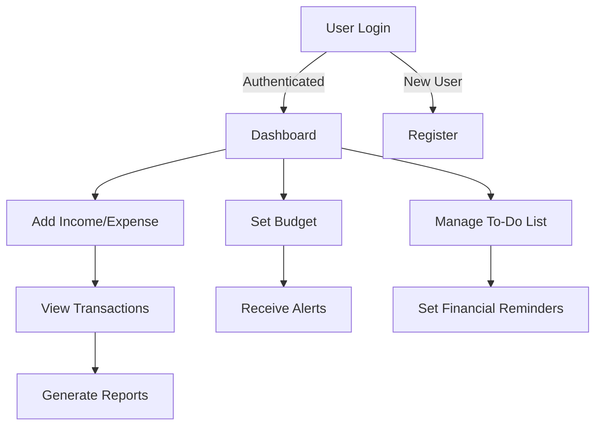

# 💰 Daily Expense Tracker - Android App

## 🌍 Overview

The **Daily Expense Tracker** is an Android application that helps users manage their **daily income and expenses** efficiently. It provides features like **budget tracking, financial reports, to-do lists, and notifications** to keep users aware of their spending habits. The app is built using **Java and SQLite**, ensuring offline data storage and smooth performance.

---

## 👥 Users & Roles

### 📊 **Registered Users**
- Create an account and log in securely.
- Add, edit, and delete **income and expense transactions**.
- Set monthly budgets and track financial goals.
- Receive notifications for due payments and budget limits.

### 🛠 **Admin (Future Scope)**
- Manage **user accounts and financial reports**.
- Provide **data export options** (CSV, PDF, etc.).

---

## 📊 Workflow Diagram



---

## ⭐ Features

### 🔑 Secure Authentication
- **User login & registration** with encrypted credentials.
- **Session management** to prevent unauthorized access.

### 💰 Income & Expense Tracking
- Add and categorize **income and expenses**.
- View **transaction history** with filtering options.
- SQLite database integration for **offline access**.

### 📊 Budgeting & Financial Insights
- Users can **set monthly budgets** and track spending.
- Receive **budget limit notifications**.
- Generate **custom financial reports**.

### ✅ To-Do List & Notifications
- Users can set **financial reminders**.
- Built-in **notification alerts** for bill due dates.

### 🎨 User-Friendly Interface
- **Material Design UI** for smooth user experience.
- **Dark mode support** (Future Scope).

---

## 📥 Installation Guide

### Step 1: Clone the Repository
```sh
git clone https://github.com/DarshanScripts/daily-expense-tracker.git
```

### Step 2: Open in Android Studio
1. Open **Android Studio**.
2. Select **Open an Existing Project**.
3. Navigate to the project folder and select `daily-expense-tracker`.
4. Wait for **Gradle sync** to complete.

### Step 3: Run the Application
1. Connect an **Android device** or launch an **Emulator**.
2. Click **Run ▶** in Android Studio.
3. The app will launch on your device.

---

## 📂 Project Structure

```
daily-expense-tracker/
│── README.md                          # Documentation
│── DailyExpenseTracker/
│   ├── build.gradle                   # Gradle build configuration
│   ├── settings.gradle                 # Project settings
│   ├── app/
│   │   ├── build.gradle                 # App-specific Gradle file
│   │   ├── proguard-rules.pro            # ProGuard rules
│   │   ├── src/
│   │   │   ├── main/
│   │   │   │   ├── AndroidManifest.xml  # App configuration
│   │   │   │   ├── java/com/example/dailyexpensetracker/
│   │   │   │   │   ├── AboutUs.java
│   │   │   │   │   ├── Accounts.java
│   │   │   │   │   ├── AddExpense.java
│   │   │   │   │   ├── AddIncome.java
│   │   │   │   │   ├── AlarmSettings.java
│   │   │   │   │   ├── DBHelper.java      # SQLite database helper
│   │   │   │   │   ├── HomeScreen.java    # Main dashboard
│   │   │   │   │   ├── Login.java         # User authentication
│   │   │   │   │   ├── Registration.java  # User registration
│   │   │   │   │   ├── Settings.java      # App settings
│   │   │   │   │   ├── ToDoList.java      # To-do list feature
│   │   │   │   │   ├── Transactions.java  # View transactions
```

---

## 💻 Technologies Used
- **Java (Android SDK)** – Backend logic.
- **SQLite** – Local database storage.
- **Material Design UI** – Enhanced UI/UX.
- **Gradle** – Build automation.
- **Android Jetpack Components** – Optimized app architecture.

---

## 👨‍💻 Author
Developed by **Darshan Shah**. Connect with me:

- **LinkedIn**: [Darshan Shah](https://www.linkedin.com/in/darshan-shah-tech/)
- **Facebook**: [DarshanScripts](https://www.facebook.com/DarshanScripts)
- **GitHub**: [DarshanScripts](https://github.com/DarshanScripts)
- **Quora**: [Darshan Shah](https://www.quora.com/profile/Darshan-Shah-1056)
- **Medium**: [DarshanScripts](https://medium.com/@DarshanScripts)
- **Fiverr**: [DarshanScripts](https://www.fiverr.com/darshanscripts)

